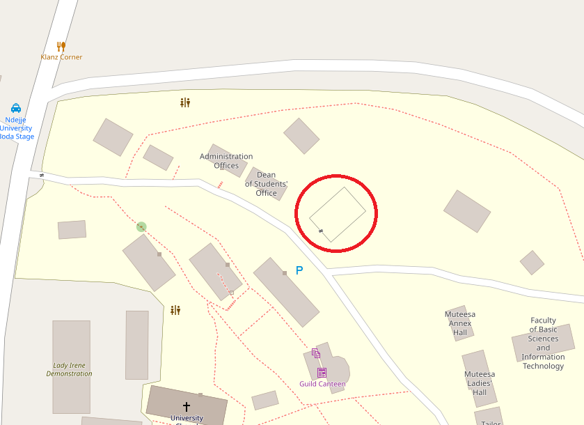

# WeatherStation
The Water Research & Development Centre is implementing an automatic weather station at Lady Irene Campus, Ndejje University, Luweero, Uganda.

## Location
The station is located at [coordinates 0.60897/32.48098](https://www.openstreetmap.org/#map=19/0.60897/32.48098)

## Measurements 
Temperature\
Relative humidity\
Atmospheric pressure\
Wind speed\
Wind direction\
Rain fall

## Data Access
Current readings will be accessible at the [centre's website](https://nduwrdc.org) and the [University's website](https://www.ndejjeuniversity.ac.ug/).
